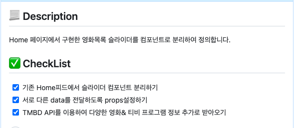

# 🍿 MyFlix

**배포 URL** : https://myflix-jun.netlify.app

### 🙋‍♂️ 프로젝트 소개

인기 OTT 사이트 Netflix UI를 바탕으로 만든 영화 & TV프로그램들의 정보와 평점을 제공하는 사이트입니다.
 

### ⚙ 개발환경

    
 

### 🔩 벡엔드 구성

[TheMovieDB API](https://developer.themoviedb.org/reference/intro/getting-started)를 통해 영화, Tv 프로그램 정보를 받아왔습니다.
 

### ⛓ node_modules

| 모듈명           | 용도                          |
| ---------------- | ----------------------------- |
| axios            | 서버 통신                     |
| framer-motion    | 애니메이션 효과               |
| react-query      | Data Fetching 관리            |
| react-rotuer-dom | 라우팅 구현                   |
| react-hook-form  | 입력 폼 상태&유효성 검사 관리 |

 

### 🛠 프로젝트 관리

- [GitHub Issue](https://github.com/junny97/myflix/issues)
  - 빠른 issue 생성을 위해 issue 템플릿을 만들어 사용하였습니다.
  - issue label을 생성하여 어떤 작업을 히는지 구분하였습니다.
  - issue를 통해 구현할 내용과 체크리스트를 만들어 어떤 작업을 할지 리스트 만들어 관리하였습니다.

 

### 📃 커밋 메시지 컨벤션

| 타입     | 설명                                                    |
| -------- | ------------------------------------------------------- |
| Feat     | 새로운 기능 추가                                        |
| Fix      | 버그 수정                                               |
| Style    | CSS 등 사용자 UI 디자인 변경                            |
| Refactor | 코드 리팩토링 (더 효율적인 코드로 변경 등)(기능은 동일) |
| Chore    | 라이브러리 설치, 패키지 매니저 수정                     |
| Docs     | 리드미 등 문서작업 수정                                 |
